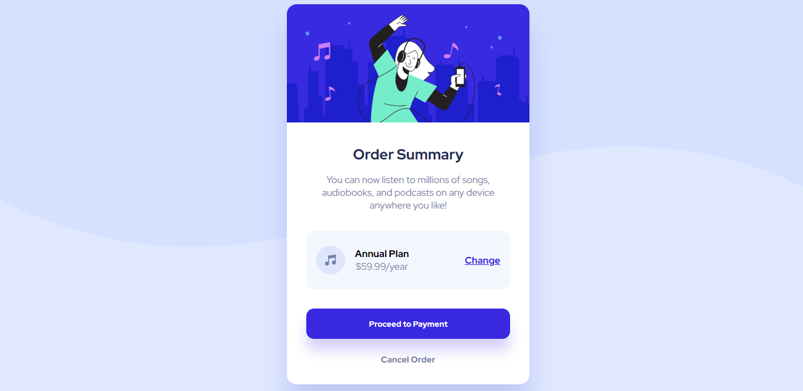

# Frontend Mentor - solução de cartão de resumo do pedido

Esta é uma solução para o desafio do cartão de resumo do pedido no Frontend Mentor . Os desafios do Frontend Mentor ajudam você a melhorar suas habilidades de codificação criando projetos realistas.

## Índice

- [Visão Geral](#Visão-geral) 
  - [Captura de tela](#captura-de-tela)
  - [links](#links)
- [Meu processo](#Meu-processo)
  - [Construído com](#construído-com)
  - [O que eu aprendi](#o-que-aprendi)
  - [Desenvolvimento contínuo](#desenvolvimento-contínuo)
  - [recursos úteis](#recursos-úteis)
 - [Autor](#Autor)

## Visão Geral

### Captura de Tela

